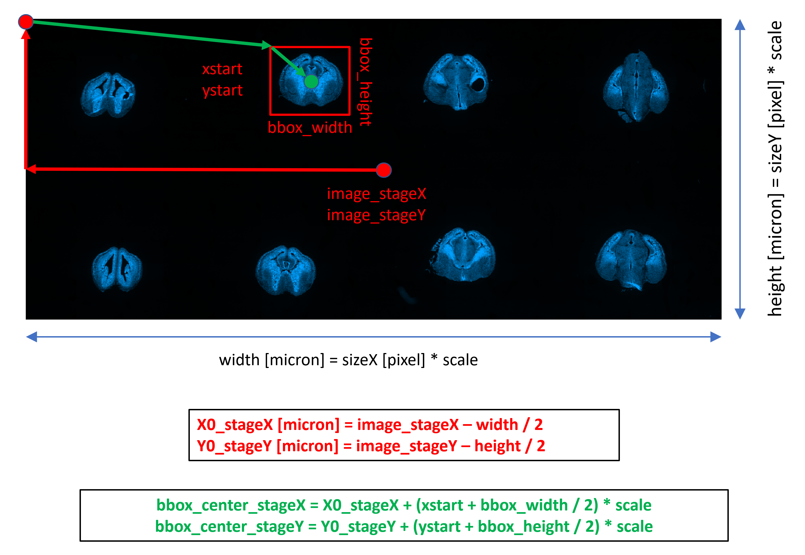

# Core Concept for using external image analysis inside Guided Acquisition

Tho most import topic is to understand the basic concept of how to transform image coordinates (created by an externalimage analysis) into ZEN stage coordinates.



The respective python function is this one:

```python
def bbox2stageXY(image_stageX=0,
                 image_stageY=0,
                 sizeX=10,
                 sizeY=20,
                 scale=1.0,
                 xstart=20,
                 ystart=30,
                 bbox_width=5,
                 bbox_height=5
                 ):
    """Calculate the center of the bounding box as StageXY coordinate [micron]

    :param image_stageX: image center stageX [micron], defaults to 0
    :type image_stageX: int, optional
    :param image_stageY: image center stageY [micron], defaults to 0
    :type image_stageY: int, optional
    :param sizeX: number of pixel in X, defaults to 10
    :type sizeX: int, optional
    :param sizeY: number of pixel in Y, defaults to 20
    :type sizeY: int, optional
    :param scale: scaleXY [micron], defaults to 1.0
    :type scale: float, optional
    :param xstart: xstart of the bbox [pixel], defaults to 20
    :type xstart: int, optional
    :param ystart: ystart of the bbox [pixel], defaults to 30
    :type ystart: int, optional
    :param bbox_width: width of the bbox [pixel], defaults to 5
    :type bbox_width: int, optional
    :param bbox_height: height of the bbox [pixel], defaults to 5
    :type bbox_height: int, optional
    :return: bbox_center_stageX, bbox_center_stageY [micron]
    :rtype: float
    """

    # calculate the width and height of the image in [micron]
    width = sizeX * scale
    height = sizeY * scale

    # get the origin (top-right) of the image [micron]
    X0_stageX = image_stageX - width / 2
    Y0_stageY = image_stageY - height / 2

    # calculate the coordinates of the bounding box as stage coordinates
    bbox_center_stageX = X0_stageX + (xstart + bbox_width / 2) * scale
    bbox_center_stageY = Y0_stageY + (ystart + bbox_height / 2) * scale

    return bbox_center_stageX, bbox_center_stageY
```

## Options for External Analysis

There are several options on how to integrate external image analysis into the Guided Acquistion workflow scripz.

### Use local Fiji

From within the Guided Acquisition script it is possible to call a locally installed Fiji (requires Fiji installation)

### Use local Python

From within the Guided Acquisition script it is possible to call a local Python Script (required Python installation) installed Fiji.

### Use APEER modules

The preferred solution is to use APEER modules (Docker containers) with a UI, which allow the user to package Fiji or Python or ... scripts into a container an execute this module from within Guided Acquisition in a defined way.

The core concept in shown in the code snippet below.

```python
# create empyt dictionary for the parameters
parameters = {}

if run_from_setting:

    # name of the APEER module seeting
    apeer_modulesetting = 'SegmentObjects_Brainslide'

    # read it from settings file
    ams = ZenApeer.Onsite.ModuleSetting()
    ams.Load(apeer_modulesetting)

    print '-----   Show APEER Module Setting   -----'
    print 'Module Name    : ', ams.ModuleName
    print 'Module Version : ', ams.ModuleVersion
    print 'Module Parameters    : ', ams.Parameters

    module_name = ams.ModuleName
    module_version = ams.ModuleVersion
    parameters = ams.Parameters

if not run_from_setting:

    # define a module name and version
    module_name = 'SegmentObjects-GA'  # use without file extension *.czams
    module_version = 3  # 0 = draft

    # define the processing parameters (or use the defaults: params.Parameters
    parameters = {'filter_method': 'none',
                  'filter_size': 5,
                  'threshold_method': 'triangle',
                  'min_objectsize': 50000,
                  'max_holesize': 1000}

# run the local APEER module with using keywords
runoutputs, status, log = ZenApeer.Onsite.RunModule(module_name,
                                                    moduleVersion=module_version,
                                                    inputs=input_image,
                                                    parameters=parameters,
                                                    storagePath=r"C:\temp\myresults.csv")
```
