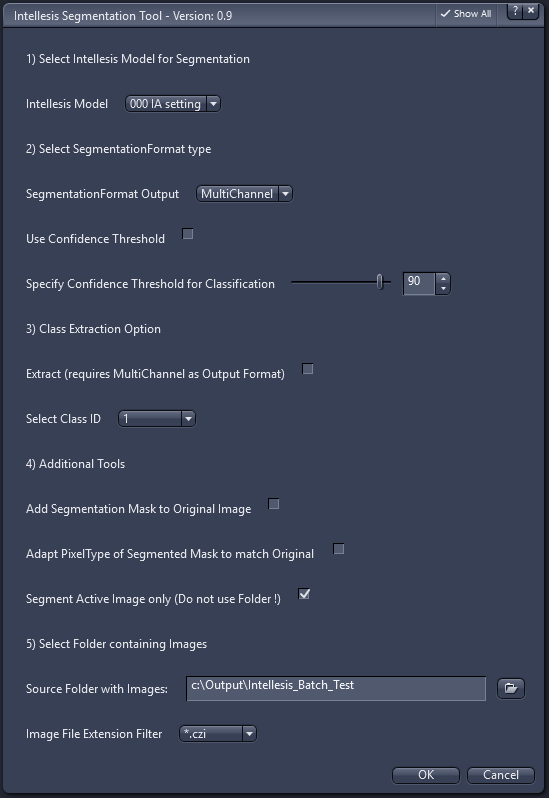
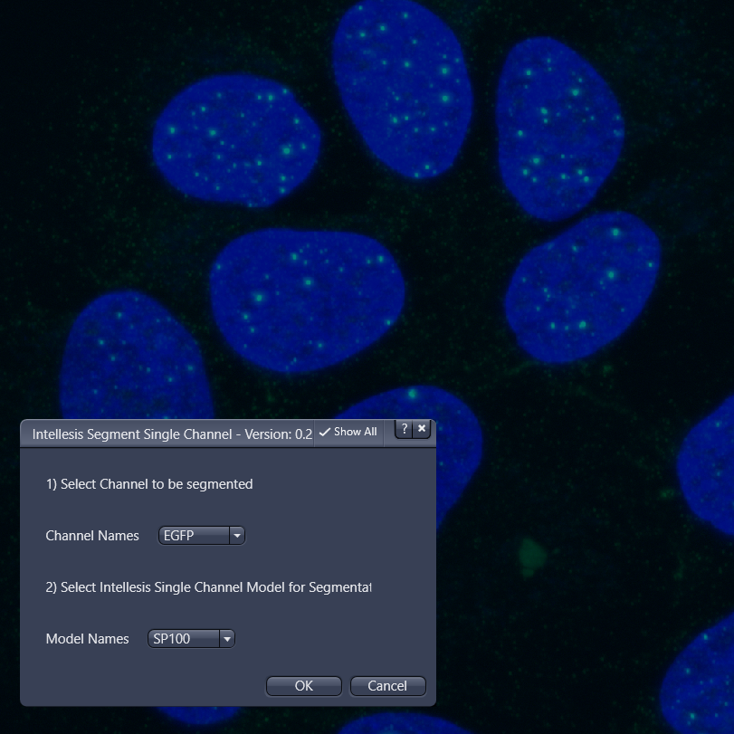
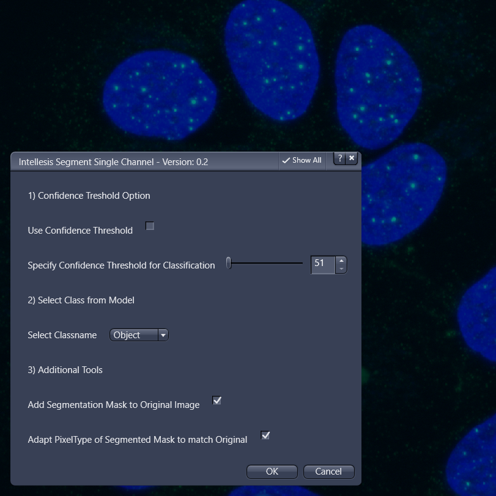
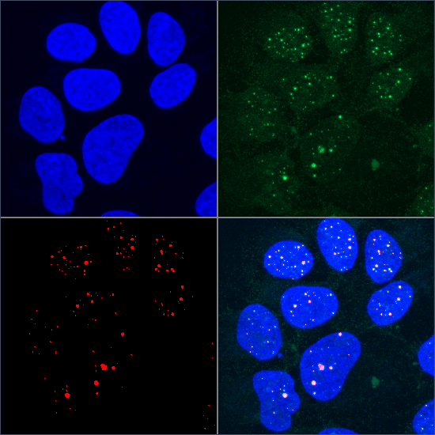

# Intellesis - Scripts

## ZEN_Intellesis_Simple_Test.py

The [script](../scripts/ZEN_Intellesis_Simple_Test.py) demonstrates the different possibilities to segment an image using a trained model. The result of such a segmentation is a mask image, which has either as many channels as the models has classes, or one channel containing a distinct label for every class.


- (top left) - raw image data data
- (top right) segmented image
- (bottom left) segmented with confidence threshold
- (bottom right) probability map image

---

## Intellesis_Segmentation_Tool.py

<!--
_ZEN Intellesis Segmentation Tool_
-->

<p></p>

The [Intellesis Segmentation Tool](../scripts/Intellesis_Segmentation_Tool.py) allows you to automate and simplify the following tasks:

- Select a model to segment images
- Specify the desired output format for the mask image
- Optional Confidence Threshold that can be applied to mask image
- Optional Extraction of a specific single class
- Option to add the mask image to the original image
- Selection of output folder with file extension filter
- Option to segment all image inside a folder or only apply to active image

Beside this tool is is also possible to run a segmentation using the ZEN built-in batch tool, which does not require this script but offers less additional options.

---

## Intellesis_Segmentation_Tool_singleCH.py

The [Intellesis Segmentation Tool Single Channel](../scripts/Intellesis_Segmentation_Tool_singleCH.py) allows you to automate and simplify the following tasks:

- It uses the current active image as an input
- Specify the channel to be segmented and the model to be uses in step 1
- Specify the desired class (for the selected model) and other option in step 2
- Apply segmentation to the selected channel
- Optionally add the mask to the original multi-channel image

Beside this tool is is also possible to run a segmentation using the ZEN built-in batch tool, which does not require this script but offers less additional options.

<!--
_Intellesis Segmentation Tool Single Channel - Step 1_
-->

<p></p>

<!--
_Intellesis Segmentation Tool Single Channel - Step 2_
-->

<p></p>

<!--
_Segmented green channel (bottom left)_
-->

<p></p>


## Intellesis_Analyze_and_Classify.py

The [Intellesis Analyze and Classify](../scripts/Intellesis_Analyze_and_Classify.py) allows you to automate and simplify the following tasks:

- Select an open image document
- Specify the Image Analysis Setting to run an Image Analysis
- Specify the Object Classification Model to classify **one** type of segemneted objects from the image analysis (class names must match!)
- Export the result tables as CSV files

<p></p>

## ZenIntellesis_API.py

The [script](../scripts/ZenIntellesis.py) demonstrates some additional function to manage model files.

```python
def find_model(name):
    """ Finds a model given its Name.

    Arguments:
        name: string
            The name of the model to look for.

    Returns: IZenIntellesisModel
        The first model with the specified name
        or None, if no such model exists.
    """
    models = ZenIntellesis.ListAvailableSegmentationModels()
    return next((m for m in models if m.Name == name), None)

modelname = 'Grains_MET101'

# find the model by name
model = find_model(modelname)

print 'Modelname : ', model.Name
print 'Model Status : ', model.Status
print model.

training_images = model.TrainingImages
for ti in training_images:
    print ti


# show all feature extractors.
all_feature_sets = ZenIntellesis.GetAvailableFeatureSets()
for fs in  all_feature_sets:
    print fs

# show all postprocessings
all_postprocessings = ZenIntellesis.GetAvailablePostProcessings()
for ps in all_postprocessings:
    print ps
```

## Intellesis_CompareTwoFeatureExtractors_UI.py

This [script](Intellesis_CompareTwoFeatureExtractors_UI.py) can be used to compare two feature extractors for a trained model.

- Select the image the model should be applied to
- Select the feature extractors and post-processings to be compared
- Optional: Define a substring in order to do the compare

<p></p>

<p></p>

## Intellesis_ConvertModel2old.py

This [script](Intellesis_ConvertModel2old.py) can be used to compare two feature extractors for a trained model.

- Export the model one wants to convert to an "older" format to a folder of your choice
- Start the script and select the folder with the exported model

<p></p>

- Select the specific model inside this folder to be converted to the older format

<p></p>

The script with backup the exported model, unpack the model, convert the model spec and package the "converted" model.
